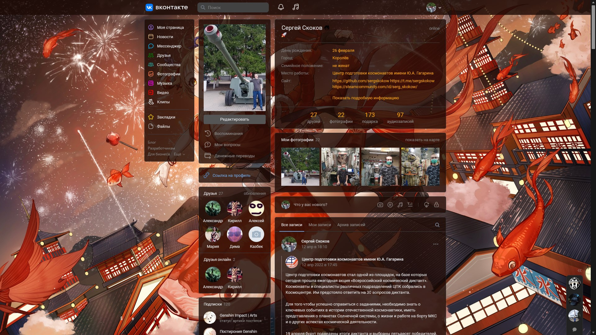

# VK style fixes
Stylesheet that improves the current VK interface.
## Colored icons

## Fixed sidebar
The sidebar is always available regardless of scrolling.
## Colored bar

## Hide call buttons 📞
Protection against accidental calls. Phone button won't be shown.
## Highlighting messages
- Unread messages
- Editable messages
- Dialogues unread by owner
- Dialogues unread by other users


## Highlighting users online
Users online become more visible.


## Background image and transparent interface
Style with light theme:

Style with dark theme:

Source: [bilibili](https://t.bilibili.com/563125724962808720).
- VK theme: Dark (set in the account menu)
- Colored bar: ✅
- Bar color: 29, 10, 5, 0.8
- Custom link color: ✅
- Link color: 255, 165, 0, 1
- Background image URL: 'https://safebooru.org//images/3466/554ff3d9e9eb8b536e038a3ae79ac4c500d35b9c.jpg'
- Translucent panels: ✅
- Panels color: 29, 10, 5, 0.8

## Stylesheet settings in Stylus

# Installation
1. Install [ Stylus](https://github.com/openstyles/stylus) for
    [ Firefox](https://addons.mozilla.org/ru/firefox/addon/styl-us/),
    [ Chrome](https://chrome.google.com/webstore/detail/stylus/clngdbkpkpeebahjckkjfobafhncgmne),
    [ Opera](https://addons.opera.com/ru/extensions/details/stylus/).
1. Click [ **Install**](https://raw.githubusercontent.com/sergskokow/VK_style_fixes/master/vk.user.css) from here.
1. Click "Install style" in the opened tab.

# Questions
## May I set background image from a local file?
You can only set a background image from web - due to web browsers security politics.
However, you also can encode your image to BASE64 format:

On Windows (PowerShell):
```powershell
[convert]::ToBase64String((Get-Content .\background.png -Encoding Byte)) > background.base64.txt
```

On GNU/Linux:
```bash
base64 -w 0 ./background.png > background.base64.txt
```

and paste it into the "Background image URL" field in the form: 
```css
"data:image/YOUR_IMAGE_FORMAT;base64,YOUR_IMAGE_CODE"
```
for example:
```css
"data:image/png;base64,iVBORw0KG......"
```

**But please be careful,** extension slows down a lot when style settings window is opened. You should not encode large images.