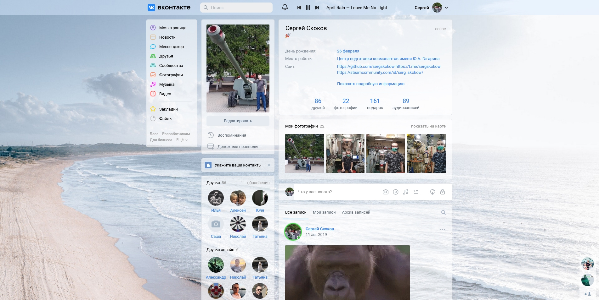
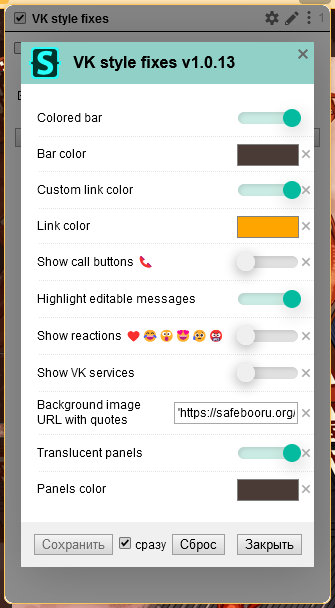

# VK style fixes
Stylesheet that improves the current VK interface.
## Colored icons

## Fixed sidebar
The sidebar is always available regardless of scrolling.
## Colored bar

## Hide call buttons 📞
Protection against accidental calls. Phone button won't be shown.
## Highlighting messages
- Unread messages
- Editable messages
- Dialogues unread by owner
- Dialogues unread by other users

## Highlighting users online
Users online become more visible.

## Background image and transparent interface
Photo author: [Ben Mack (Pexels)](https://www.pexels.com/ru-ru/photo/5326945/).

## Stylesheet settings in Stylus

# Installation
1. Install [ Stylus](https://github.com/openstyles/stylus) for
    [ Firefox](https://addons.mozilla.org/ru/firefox/addon/styl-us/),
    [ Chrome](https://chrome.google.com/webstore/detail/stylus/clngdbkpkpeebahjckkjfobafhncgmne),
    [ Opera](https://addons.opera.com/ru/extensions/details/stylus/).
1. Click [ **Install**](https://raw.githubusercontent.com/sergskokow/VK_style_fixes/master/vk.user.css) from here.
1. Click "Install style" in the opened tab.